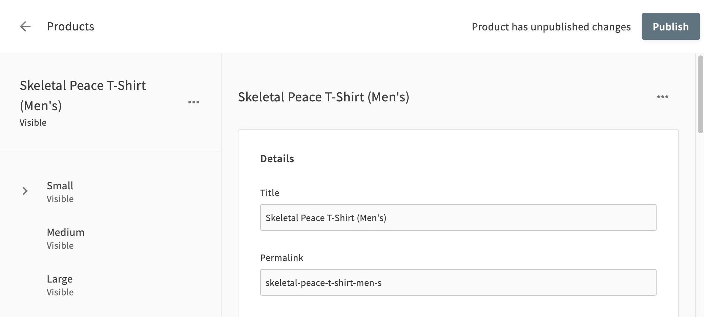
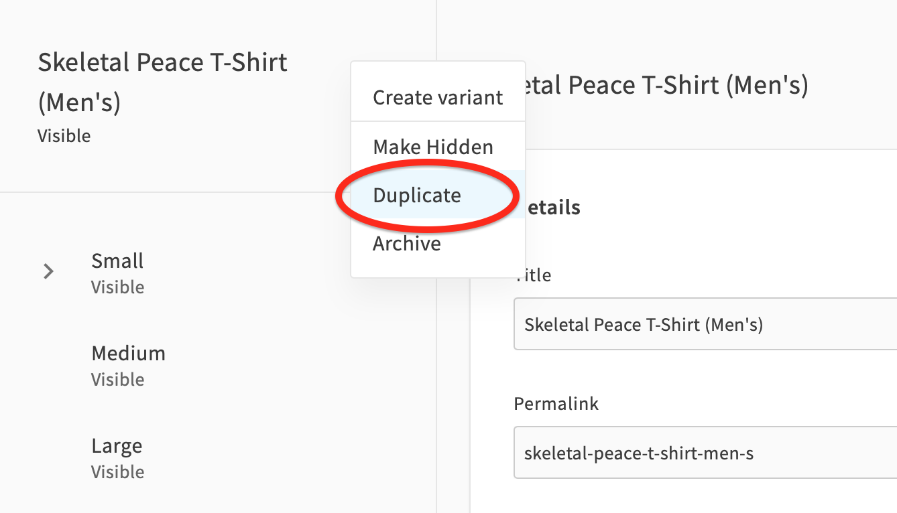
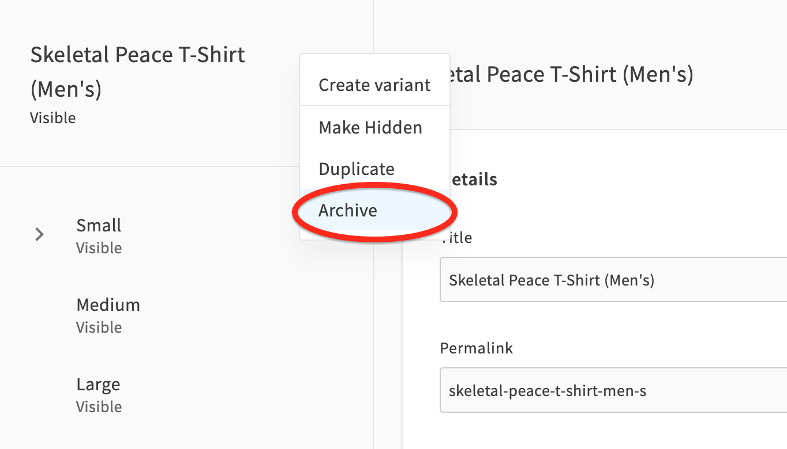

## The basics
Every Mailchimp Open Commerce store is built around products: the items in your store. Every product must have at least one variant—a descriptive aspect of the product, such as size, color, or model—and depending on how you organize your store, products can also have second-level variants, which are called options.

You can create products, variants, and options in the Open Commerce admin dashboard without making them live on your site, though for products to be added to your catalog, you first need to publish the products and then make them visible to customers. If you no longer want to offer a product for sale, you can hide it from customers or archive it to remove it from your store permanently.

This documentation outlines the structure of products, how to set up new products from scratch, and how to manage existing products within your store.

### Products and variants
A product in Open Commerce represents a single type of item that you want to list in your store’s catalog; variants are properties of that item. Every product must have at least one variant, because some information is set at the product level and some is set at the variant level. Depending on what you are selling—and how you want to organize and manage your inventory—each product might have a single variant or multiple variants.

For example, you could have a particular design of T-shirt (the product) that has multiple sizes (its variants). In that case, the design would appear as a single entry on catalog pages, and the variants would be visible on the product page.

In another example, a bookseller could carry a particular book title in hardcover, paperback, and e-book editions. Different businesses might make different choices: you might want all three as variants of a single product; you might group the physical books in one product and the e-book in another; or you might set up all three as separate products. Pricing is set at the variant level, so all three book editions could be sold at different prices in any of these product/variant configurations.

### Options
Open Commerce provides yet another level of organizational flexibility with options. If you include options in a product, the customer must make a choice at each variant level. These choices uniquely identify an exact product configuration, called a terminal variant—and only terminal variants can be added to carts. If a variant does not contain options, then it is also a terminal variant.

Expanding our t-shirt example, a particular design (product) could be printed on two different colors of shirt (variants), each of which comes in three sizes (options). To order one of these shirts, a customer has to make two choices to specify their desired terminal variant. Ordering just a red shirt without specifying a size, or just a large shirt without specifying a color wouldn’t make any more sense in an Open Commerce store than it would in a bricks-and-mortar store!

## Create a product

To create a product, log in to the Open Commerce admin dashboard, click **Products** in the left sidebar, and then click **Create product**. You’ll add details about the product on various cards:

- Enter the product information in the **Details** card.
- To add images, click **Drag image or click to upload** in the **Media Gallery** card. Once uploaded, you can use the Order fields to set the order that the images appear in.
- Customize the product’s social sharing messages under the **Social** card.
- Add tags by clicking on the **+** button in the **Tags** card. Select tags from the dropdown menu in the dialog, and then click **Add tags to products**. (See the [Tags and Navigation documentation](/open-commerce/docs/tags-navigation) for further information on creating new tags.)

Make sure to click **Save changes** on each card where you have entered the new information.

Once you’re finished, make your product visible by clicking the **⋯** button next to its name and then clicking **Make Visible**. This creates the product, but it can’t be published yet—to be publishable, it will need to have at least one variant.

## Configure a variant
Variants allow you to create different versions of the same base product. Because it’s mandatory to have at least one variant to publish a product, every product comes filled with one default, required variant.

To create additional variants, click the **⋯** button next to the product's name, click **Create variant**, and fill out the following fields:

| Field | Description |
| ----- | ----------- |
| Attribute label | Required. The attribute label describes the category of the variant, for example, “Color” or “Size”. |
| Short title | The short title describes this particular variant within the category set by the attribute label. For example, a variant with the attribute label “Color” might have the short title “Red”. This is usually shown in a drop-down list or button on the product detail page in your shop. |
| Title | The full title is usually shown on carts, checkout pages, order summary pages, and invoices. It should fully describe the configured variant. For example, if this is an option with the short title “Large”, its parent variant has a short title “Red”, and the product title is “Fancy T-Shirt”, then a good title would be “Fancy T-Shirt – Red – Large”. |
| Origin country | Optional. |
| Width, Length, Height, Weight | Optional. Units for these measurements can be changed under **Settings > Shop Localization**. |
| Price | Required. Enter a number without currency symbols. |
| Compare at price | Optional. Use this to display a price other than what you are currently selling a product for, such as a suggested retail price or the regular price of an item that is on sale. |
| Manage inventory | Optional. If you’d like to track the item in your inventory, check this box. **Quantity** – Optional. Enter your current inventory quantity.**Warn at** – Optional. When the item’s quantity is lower than this number, “Limited Supply” notifications will be displayed on product pages.**Allow backorder** – Optional. When enabled, customers can order the product even if the inventory quantity is 0.|
| Taxable | Optional. Check this box to automatically add tax to this item when purchased. When checked, you can optionally add a variant-specific tax code or leave the Tax Code field blank to use the code set in **Settings > Taxes > Default tax code for products**. |

Once you’ve added the variant’s information, make the variant visible by clicking the **⋯** button next to the variant’s name and then clicking “Make Visible.” As a reminder, you can’t publish a new product unless the product itself and all of its variants are made visible.

## Add options to a variant
Options provide a second layer of customization within each variant. For instance, in addition to carrying shirts in multiple colors, you may also want to carry multiple size options for each color.

To create an option:

1. Hover over the variant you’d like to create an option for. Click the **⋯** button to the right of its name and then click **Create variant**.

2. Add the option’s information as you would when [creating a top-level variant](#configure-a-variant).

3. To make the option visible, hover over the variant name, click the **⋯** button, and then click **Make Visible**.

## Publishing, hiding, and showing
Configuring products and variants do not make them immediately visible to customers. Products can be marked as visible or hidden, which determines whether customers can see them in your shop. When you click **Publish**, all your saved changes will become visible to customers.

Products published to the catalog cannot be unpublished, though they may be set as hidden, so customers can’t see them in the storefront. To change change the visibility of a product, variant, or option, click the **⋯** button next to the product title in the left sidebar and select **Make Hidden** or **Make Visible**.

Visibility settings are available for the top-level product, each variant, and each option. Hiding the product will also hide the product’s variants and options from the storefront. Hiding a variant will hide that variant and all of its options, while hiding an individual option will affect only that option.

> **Note**: In some cases, logged-in administrators may be able to see hidden products on public store pages—even though they are hidden from customers.

## Duplicating products
Duplicating a product, variant, or option will create a new copy of that item, including its children. This can be a useful tool for speeding up creation of similar products, variants, or options.

To duplicate a product, variant, or option, click the **⋯** button next to the product title and select **Duplicate**. Click the **Publish** button at the top right of the window to make your changes appear on the shop.

## Archiving products
You can archive a product to remove it from both the storefront and the admin dashboard. Archiving a product is immediate upon confirmation and is not reversible from the admin dashboard. If you think you may want to use the product again in the future, it may be better to make the product hidden instead.

To remove a product, variant, or option from your shop, click on the **⋯** button next to the product, variant, or option title, and select **Archive**.

## Bulk actions and filtering
You can perform bulk actions on multiple products at once, either by selecting the products manually by clicking the checkbox next to them, or using the filtering feature. To filter by name, type in the field above the product list.

You can also filter by product ID:

1. Create a CSV file with a comma-separated list of product IDs you’d like to filter.
2. Click the **Actions** menu and choose **Filter by file**.
3. Click **Import** and choose the CSV file you’d like to use.
4. Click **Filter products**.

Once you’ve filtered the products, you can use the **Actions** menu to perform bulk actions on them, including adding or removing tags, publishing, hiding or showing, duplicating, or archiving them.

