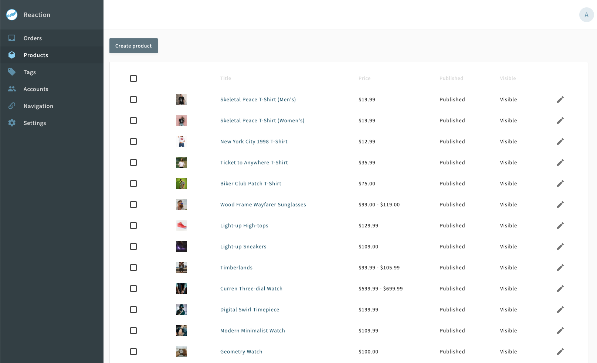
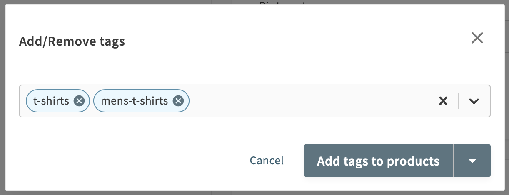
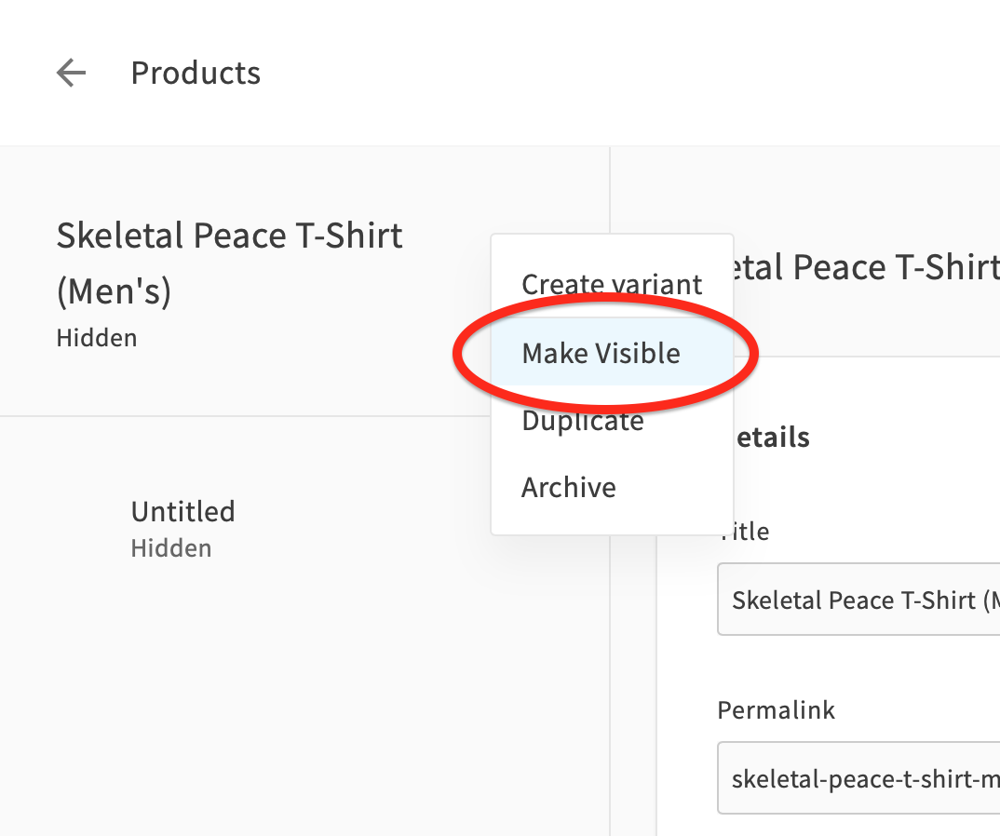
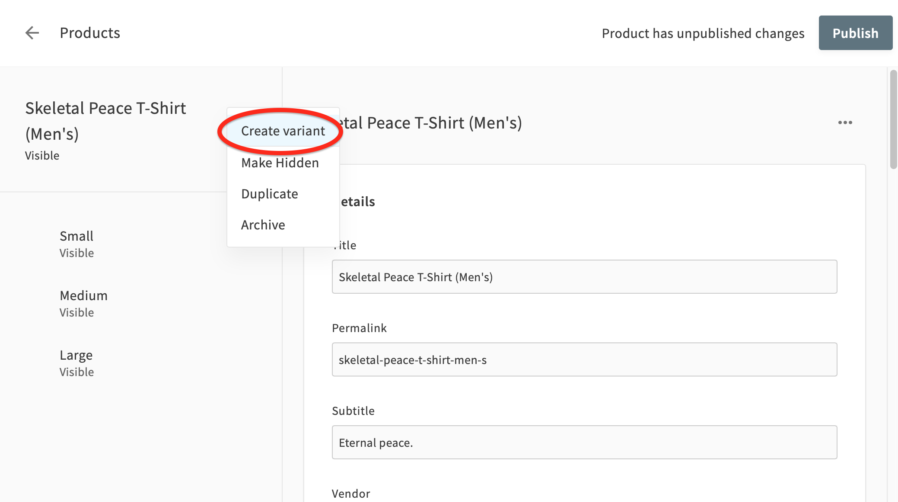
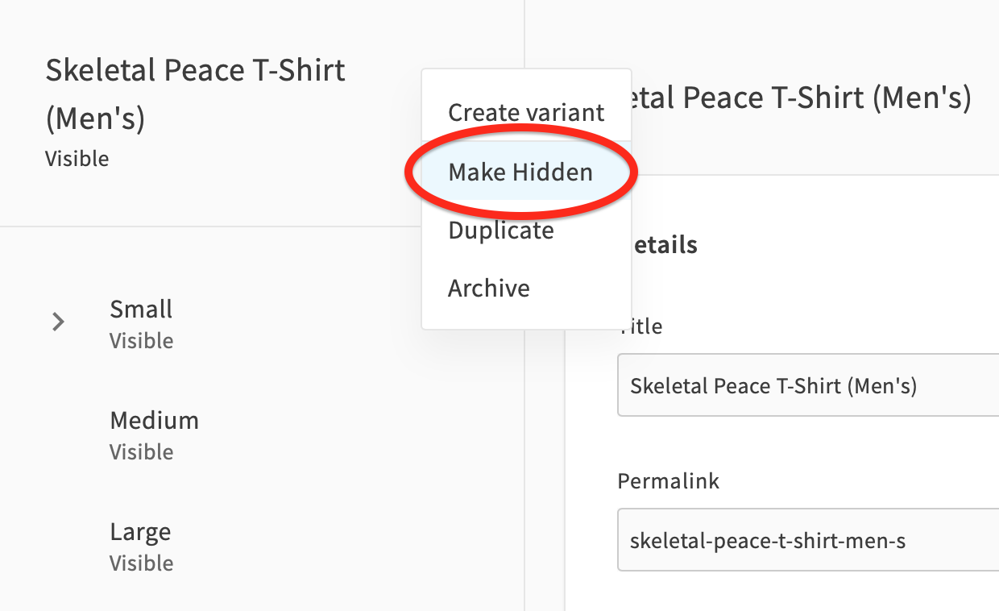

## The basics

The term *product* in Reaction Commerce refers to a single type of item that is available in a shop catalog, for example, "Pair of Best Brand shoes, Model B". A product cannot be directly ordered, though. Each product must have at least one *variant* added to it.

A variant defines a certain product configuration, describing a discrete, orderable item. For example, the “Pair of Best Brand Shoes, Model B” product might have three variants, “Size 9”, “Size 10”, and “Size 11”.

If necessary, a variant can have further variants, which we call *options* or *second-level variants*. For example, the “Size 9” variant for “Pair of Best Brand Shoes, Model B” may come in two different colors, black and red. So the “Size 9” variant would have two variants of its own, “Black” and “Red”.

💡 **Note**: Only a terminal variant may be ordered. So if a variant has options, a shopper will need to order one of the options, but if a variant has no options, that variant itself may be ordered.

## Creating a product

To create a product, log in to the Reaction admin dashboard and follow these steps:

1. Click **Products** in the left sidebar.

2. Click **Create product**.

3. You can change the product title, permalink, subtitle, vendor, description, and origin country and more in the **Details** card.
  

3. To add images, click the **Drag image or click to upload** button. Once uploaded, you can use the Order fields to set the order that the images appear in.
  

4. You can customize your product's social sharing messages under the Social card.

5. Add product tags by clicking on the **+** button. Select tags from the dropdown menu in the dialog, and then click **Add tags to products**. (If you need to create a new tag, see [tk Tags doc] for further information.)
  

6. Make sure that you click **Save changes** in each card where you have entered new information.

7. Make your product visible by clicking the **⋯** button next to its name and then clicking **Make Visible**.
  

This creates the product, but it can't be published yet. To be publishable, it will need to have at least one variant.

## Configuring a variant

Variants allow you to create different versions of the same base product. Variants are perfect for products that come in multiple colors, sizes, shapes, etc. Every product comes filled with one default, required variant. 

To create more variants:

1. Click the **⋯** button next to the product's name, and then click "Create variant."
  
2. Fill out the following fields:

	- **Attribute label** – Required. The attribute label describes the category of variant, for example, "Color" or "Size".
	- **Short title** – Required. The short title describes this particular variant within the category set by the attribute label. For example, a variant with attribute label "Color" might have short title "Red". This is usually shown in a drop-down list or button on the product detail page in your shop.
	- **Title** – Required. The full title is usually shown on carts, checkout pages, order summary pages, and invoices. It should fully describe the configured variant. For example, if this is an option with short title "Large", its parent variant has short title "Red", and the product title is "Fancy T-Shirt", then a good title would be "Fancy T-Shirt – Red – Large".
	- **Origin country** – Optional.
	- **Width, Length, Height, Weight** – Optional. [tk link to where you set units for these]
	- **Price** – Required. Enter a number without currency symbols.
	- **Compare at price** – Optional. The suggested retail price of your product.
	- **Manage inventory** – Optional. If you'd like to track this item in your inventory, check this box
		- **Quantity** – Enter your current inventory quantity.
		- **Warn at** – Optional. Allows for "Limited Supply" notifications to be displayed on product pages when quantity is lower than this number.
		- **Allow backorder** – Optional. Allows customers to backorder the product.
	- **Taxable** – Optional. Check this box to automatically add tax to this item when purchased. [tk explain what this actually means Add Tax code and Tax description for more options.]

3. Make your variant visible by clicking the **⋯** button next to the product's name and then clicking "Make Visible."

## Adding Options to a Variant

Options provide a second layer of customization within each variant. For instance, in addition to carrying shirts in multiple colors, you may also want to carry multiple size options for each color. To create an option:

1. Hover over the variant you'd like to create an option for. Click the **⋯** button to the right of its name and then click **Create variant**.
  

2. Add the option's information as you would when [creating a top-level variant](#configuring-a-variant). 

3. To make the option visible, hover over the variant name, click the **⋯** button, and then click **Make Visible**. 

4. Click the **Publish** button at the top right of the window to make your changes show up on your shop.

## Publishing changes

Your changes might be saved, but they're not immediately visible to customers. Publishing your changes with the **Publish** button will take all your saved changes  and make them visible to customers. Products may be to be made **Not Visible** which will hide the product from customers, even if it's published.

💡 **Note**: Products published to the Catalog cannot be unpublished. They may be hidden from the storefront using the visibility controls outlined in the [Hiding and showing products from your storefront](#hiding-and-showing-products-from-your-storefront) section.

## Hiding and showing products

Products can be marked as visible or hidden, which determines whether customers can see them on your shop. 

These options are available for the top-level product, each variant and each option. Hiding the product will hide the entire product from the storefront. Hiding a variant will hide that variant and all of its options, while hiding an individual option will affect only that option.

💡 **Note**: In some cases, an administrator signed into the shop may still be able to see products marked as hidden.

To change change the visibility of a product, variant, or option:

1. Click the **⋯** button next to the product title in the left sidebar.
  

2. Select **Make Hidden** or **Make Visible** and confirm.
  

3. Click the **Publish** button at the top right of the window to make your changes appear on the shop.

## Duplicating products, variants, and options

Duplicating a product, variant, or option will create a new copy of that item, including its children. It can be a useful tool for speeding up creation of similar products, variants, or options.

To duplicate a product, variant, or option:

1. Click the **⋯** button next to the product title.
  

2. Select **Duplicate** and confirm.
  

3. Click the **Publish** button at the top right of the window to make your changes appear on the shop.

## Archiving a product

Archiving products is immediate upon confirmation, and is not reversible from the Reaction admin dashboard. It may be a better to make the product hidden with the **Make Hidden** option instead. Variants and options can also be archived.

To remove an entire product, variant, or option from your shop:

1. Click on the **⋯** button next to the product, variant, or option title.
  

2. Select **Archive** and confirm.
  

3. Click the **Publish** button on the top right to make your changes appear on the shop.

## Discounting products

Reaction has support for discount codes, which can be entered during checkout and apply to the subtotal for that particular order.  
[tk Discount rates are applied automatically to all orders.
discount rates don't seem to appear in UI]

Discount codes can be enabled from the **Discounts** section of the Reaction sidebar. To create a new discount code, click **Add Discount** and enter the following:

- **Discount Code**: a case-sensitive string, which customers must enter to receive the discount
- **Discount**: a string or number (see Calculation Method below)
- **Account Limit**: number of times a single customer can use the code
- **Total Limit**: number of times all customers combined can use the code
- **Calculation Method**: determines how the Discount value applies
	- Credit: A credit is applied to the order subtotal, up to the Discount value.
	- Discount: The Discount value is applied as a percentage of the order subtotal.
	- Sale: Item pricing is overridden with a fixed sale price. [tk applies to all items? how does this work?]
	- Shipping: The Discount value should be a string that matches the name of a shipping method. The calculated shipping rate will be applied as a discount.

Discounts are validated when a customer enters a code during checkout, and they are applied as payment methods on the cart. The discount code usage is tracked once the order has been placed.
